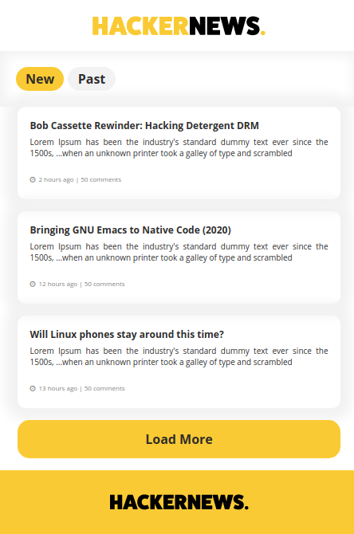

# HackerNewsClone
## Table of contents

- [General info](#general-info)
- [Screenshots](#screenshots)
- [Technologies](#technologies)
- [Setup](#setup)
- [Features](#features)
- [Contact](#contact)

## General info

A frontend application that fetches the data from HackerNews API featuring multiple functionalities

## Screenshots

## Technologies

- React.js
- axios
- SCSS
- BEM

## Setup

Feel free to clone the app, install with the command `npm install` or `yarn install ` and run `npm start` or `yarn run`

## Features

- Fetch web api
- Switch to two different API URL
- Load More articles 
- Mobile-first Design
- Every artilce link redirects to the current post

## Contact

Created by [Grigor Fanyan](https://www.linkedin.com/in/gregfanyan/)
